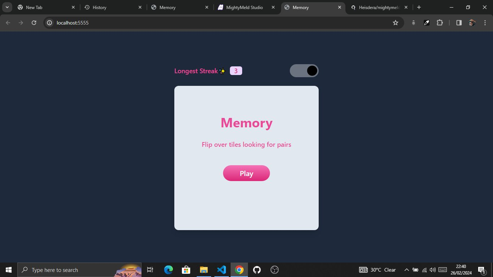
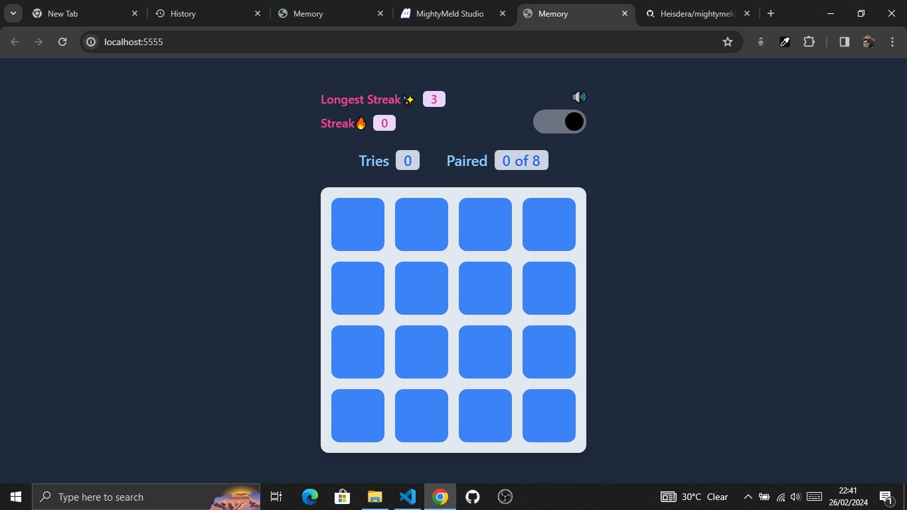

# Memory Game - Tailwind CSS

## Development - Entry for Most Impressive Expanded Functionality 

Welcome to my creative build added functionalities build summary

- Implemented Dark mode with localStorage, ensuring persistence across user sessions.
- Enabled automatic switch to Dark mode when the system theme changes between light and Dark.
- Implemented sound effects for tile flips, matches, mismatches, and game completion to enhance user experience.
- Then Additionally, introduced streak count and longest streak scores for each game session, stored in localStorage and updated whenever the user surpasses their previous longest streak score.

